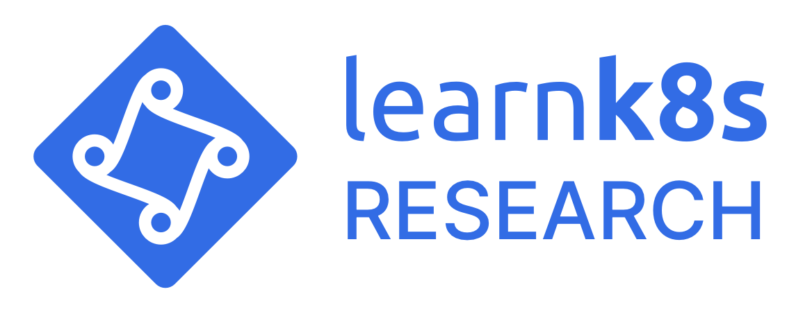

# Kubernetes research

The current research is available here:

- [Kubernetes managed services](https://docs.google.com/spreadsheets/d/1RPpyDOLFmcgxMCpABDzrsBYWpPYCIBuvAoUQLwOGoQw)
- [Kubernetes service meshes](https://docs.google.com/spreadsheets/d/1Bxf8VW9n-YyHeBiKdXt6zytOgw2cQlsDnK1gLUvsZ4A)
- [Choosing an instance type for a Kubernetes cluster](https://docs.google.com/spreadsheets/d/1yhkuBJBY2iO2Ax5FcbDMdWD5QLTVO6Y_kYt_VumnEtI)

## Roadmap

What you should expect next:

- Analysis of container runtime interfaces (CRIs)
- Analysis of container networking interfaces (CNIs)
- Analysis of ingress controllers
- Analysis of API gateways
- Analysis of CI/CD tools

## Contributing

If you spot a typo or an out-of-date spec, leave a comment on the spreadsheet or get in touch at [research@learnk8s.io](mailto:research@learnk8s.io).

**Are you interested in adding more research?**

If you wish to contribute with new comparison, charts, or any other research join the #research channel in [Slack](https://learnk8s.slack.com).

> [You can join the Learnk8s Slack workspace with this link.](https://learnk8s-slack-invite.herokuapp.com/)

If you need some ideas, here's a shortlist:

- How does [DigitalOcean Kubernetes](https://www.digitalocean.com/products/kubernetes/) compare with the rest of the [Kubernetes managed services](https://docs.google.com/spreadsheets/d/1RPpyDOLFmcgxMCpABDzrsBYWpPYCIBuvAoUQLwOGoQw)?
- How does [IBM Cloud Kubernetes Service](https://cloud.ibm.com/docs/containers?topic=containers-getting-started) compare with the rest of the [Kubernetes managed services](https://docs.google.com/spreadsheets/d/1RPpyDOLFmcgxMCpABDzrsBYWpPYCIBuvAoUQLwOGoQw)?
- How does [Alibaba's Container Service for Kubernetes](https://www.alibabacloud.com/product/kubernetes) compare with the rest of the [Kubernetes managed services](https://docs.google.com/spreadsheets/d/1RPpyDOLFmcgxMCpABDzrsBYWpPYCIBuvAoUQLwOGoQw)?
- What's the average CPU workload for Kubernetes Pods? How does affect [instance types](https://docs.google.com/spreadsheets/d/1yhkuBJBY2iO2Ax5FcbDMdWD5QLTVO6Y_kYt_VumnEtI)?

**Great, but I'm better at coding."**

More research can be unlocked if we can provision several clusters in different cloud providers and run tests.

If you have an idea on how to do that and want to contribute, let's [chat on Slack](https://learnk8s.slack.com) or [drop us an email](mailto:research@learnk8s.io).
